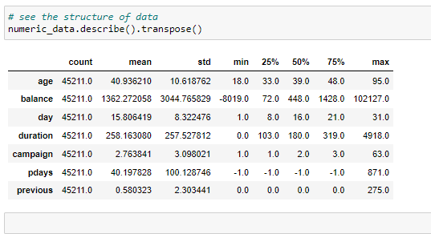
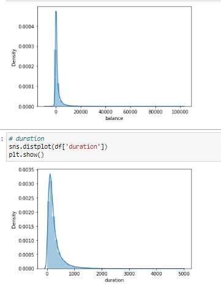
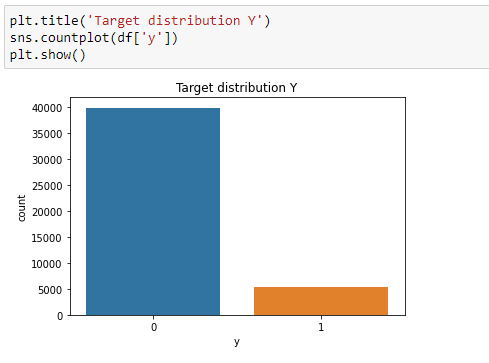
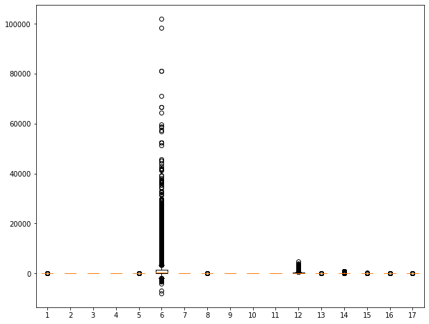
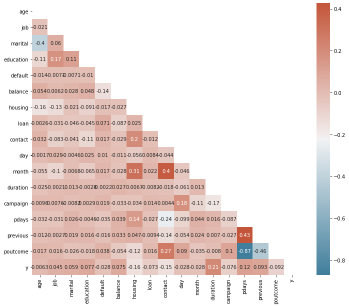
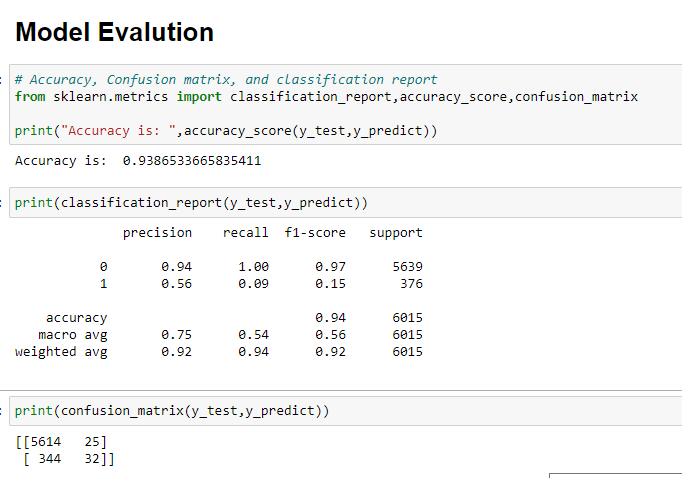

# LogisticRegression_
## The Logistic Regression is a regression model in which the response variable (dependent variable) has categorical values such as True/False or 0/1. It actually measures the probability of a binary response as the value of response variable based on the mathematical equation relating it with the predictor variables.

## The general mathematical equation for logistic regression is −

## y = 1/(1+e^-(a+b1x1+b2x2+b3x3+...))
## Output variable -> y
## y -> Whether the client has subscribed a term deposit or not 
## Binomial ("yes" or "no")

# Attribute information For bank dataset

   Input variables:
   # bank client data:
   ### 1 - age (numeric)
   ### 2 - job : type of job (categorical: "admin.","unknown","unemployed","management","housemaid","entrepreneur","student",
                                       "blue-collar","self-employed","retired","technician","services") 
  ###  3 - marital : marital status (categorical: "married","divorced","single"; note: "divorced" means divorced or widowed)
  ###  4 - education (categorical: "unknown","secondary","primary","tertiary")
  ###  5 - default: has credit in default? (binary: "yes","no")
  ###  6 - balance: average yearly balance, in euros (numeric) 
  ###  7 - housing: has housing loan? (binary: "yes","no")
  ###  8 - loan: has personal loan? (binary: "yes","no")
   # related with the last contact of the current campaign:
  ###  9 - contact: contact communication type (categorical: "unknown","telephone","cellular") 
 ###  10 - day: last contact day of the month (numeric)
  ### 11 - month: last contact month of year (categorical: "jan", "feb", "mar", ..., "nov", "dec")
  ### 12 - duration: last contact duration, in seconds (numeric)
   # other attributes:
  ### 13 - campaign: number of contacts performed during this campaign and for this client (numeric, includes last contact)
  ### 14 - pdays: number of days that passed by after the client was last contacted from a previous campaign (numeric, -1 means client was not previously contacted)
  ### 15 - previous: number of contacts performed before this campaign and for this client (numeric)
  ### 16 - poutcome: outcome of the previous marketing campaign (categorical: "unknown","other","failure","success")

  Output variable (desired target):
 ###  17 - y - has the client subscribed a term deposit? (binary: "yes","no")

### 8. Missing Attribute Values: None

# Dataset structure

# plot

# visulize target feature

# Outliers

# Correlation

# evaluaiton

